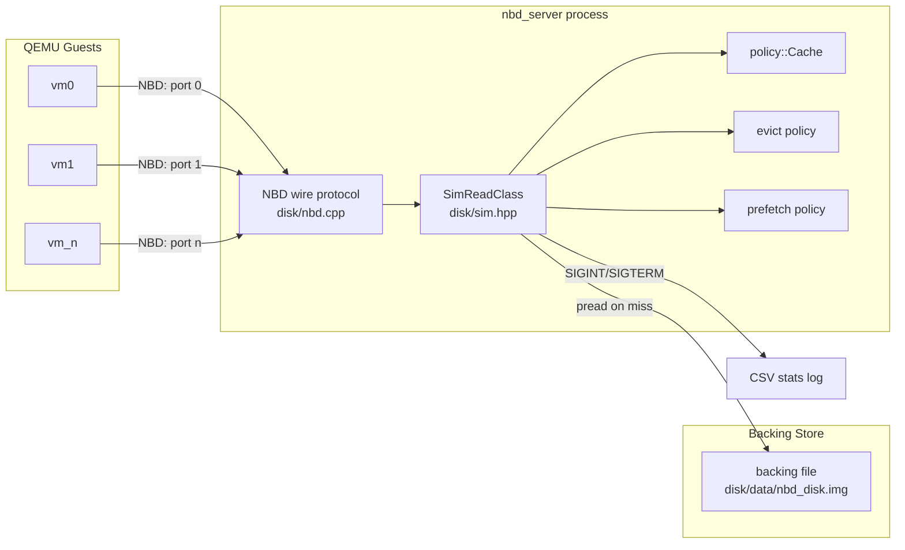

# ARCHITECTURE.md

## System diagram

`kvm/launch.py` (not pictured above — it's a separate control-plane process,
not part of the read path) reads a YAML config and shells out to
`qemu-system-x86_64` once per VM, wiring each VM's disk(s) to `nbd_server`
host:port pairs via QEMU's own `driver=nbd` block backend. It never talks to
`nbd_server` directly — it only starts/stops/waits-on the QEMU processes.

## Key design decisions (why, inferred from code/comments)

- **One TCP port = one client identity, not one export.** `nbd_server`'s
  NBD handshake ignores the requested export name entirely — every port on
  a process serves the same backing file. Ports exist purely so
  `SimReadClass` can key its per-client virtual-time/cache-warmup state
  (`worker_id`) by which port a VM dialed. Trade-off: VMs sharing one
  `nbd_server` process cannot have different disk contents — that requires
  separate processes/configs. (`disk/nbd.cpp` top comment, `AcceptLoop`.)

- **`pread`, not `fseek`+`fread`, for the backing file.** The backing
  `FILE*` is shared across every client-handling thread; `pread`'s explicit
  offset makes each read atomic/thread-safe without a lock, where
  `fseek`+`fread` would race on the file's shared position across threads.
  (`disk/sim.hpp`.)

- **Graceful shutdown via `sigwait`, not a `SIGINT` handler.** `SIGTERM`/
  `SIGINT` are blocked on every thread before any are spawned, then the main
  thread blocks in `sigwait` — the same pattern the (now-deleted) `ldat.cpp`
  used. This lets the server run its normal accept-loop threads without a
  signal-handler-safety footgun, and gives it a clean point to compute and
  log final stats before exiting. (`disk/nbd.cpp` `main()`.)

- **A minimal hand-rolled YAML subset for `nbd_server`'s own config**,
  instead of a YAML library dependency: flat `key: value` lines, `#`
  comments, one inline bracketed list (`ports:`). Kept intentionally small
  — `LoadConfig` in `disk/nbd.cpp`. (`kvm/launch.py`, by contrast, uses real
  PyYAML since Python has it as a lightweight, ubiquitous dependency.)

- **Bounded per-page follower tracking in the association-mining
  policies** (`cminer`/`quickmine`/`mithril`). Without a cap, a hot page
  under a skewed workload accumulates an ever-growing follower list and
  re-ranking it on every prediction becomes quadratic-total-time — this was
  hit in testing at 20k+ requests/client. `max_tracked` (default 16) bounds
  `observe()`/`predict()` to O(max_tracked) regardless of trace length, at
  the cost of approximating rarely-seen followers. (`policies/assoc_miner.h`.)

- **Stream-based (not page-based) LRU/readahead for the `*_cxt_aware`
  policies.** `StreamTracker` mimics a hardware stride/stream prefetcher:
  per-context, a small fixed number of stream "heads" track the most
  recently seen address; a new access joins a head within `attach_window`
  or starts a new stream, evicting the least-recently-touched head under
  pressure. `ContextAwareLRUPolicy` then does recency/eviction at the
  stream level (whole stream promoted/evicted together) rather than per
  page. (`policies/stream_tracker.h`, `policies/policy_lru_cxt_aware.cpp`.)

- **Guest writes are never persisted — by design, not a bug.** `nbd_server`
  opens the backing file read-only (`fopen(..., "rb")`) and its `kCmdWrite`
  handler just discards the payload. This is why `make guest-image` boots
  guests with `systemd.volatile=yes` (root read-only + tmpfs overlay for
  `/etc`/`/var`) — the guest OS itself must never depend on a write actually
  landing on disk. (`disk/nbd.cpp`, `kvm/guest/build_image.sh`.)

- **`nbd_server`'s stats log is modeled on two now-deleted programs**
  (`dat.cpp`'s `STATS key=value ...` stdout line, `runner.cpp`'s
  header-on-first-write CSV append) rather than invented fresh, so the
  columns/semantics (hit ratio, avg latency, hostname, git commit) carry
  over from that earlier synthetic-workload pipeline even though the
  request source (real VMs) changed completely. (`disk/nbd.cpp`
  `AppendLog`/`PrintStatsLine`; the originals are recoverable via
  `git show HEAD~N:dat.cpp` etc. if ever needed for comparison.)

## External dependencies

- **QEMU** (`qemu-system-x86_64`) — the only real external service
  dependency; `kvm/launch.py` shells out to it directly (no library
  binding). `/dev/kvm` is optional (falls back to TCG software emulation).
- **`debootstrap`** — only for the optional `make guest-image` path,
  Debian/Ubuntu-only, needs root.
- **PyYAML** — `kvm/launch.py`'s only Python dependency.
- No network services, databases, or third-party APIs are involved anywhere
  in the live code path.

## Data model

There is no persistent application data model — the "data" is whatever
bytes live in the backing file (`disk/data/nbd_disk.img`), treated as an
opaque block device. The only structured state is:

- **`policy::Cache`**: an in-memory `unordered_set<uint64_t>` of resident
  page numbers (`SECTOR_SIZE`-granularity), not a byte cache — it tracks
  *presence*, not content. (`policies/policy_api.h`.)
- **CSV stats log** (`nbd_results.csv` by default): one row per clean
  server shutdown — see `README.md`'s "Logging Schema" section for the full
  column list.
