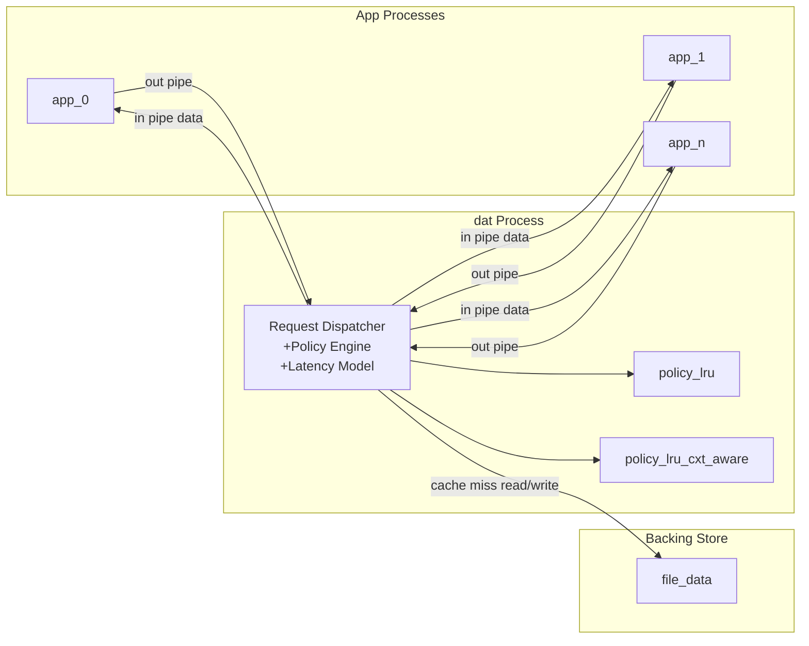

# newexp2 Cache Policy Experiment

This experiment compares software-managed cache replacement policies for N server apps that access a shared remote volume.

The runtime model is:

1. `runner` creates 2*N pipes and starts one `dat` process.
2. `runner` starts N app processes (`scan` or `random-read`).
3. Each app sends requests to `dat` over an outbound pipe and receives data over an inbound pipe.
4. `dat` serves each request from cache (hit) or backing store (miss), optionally adding configured latency.
5. `runner` aggregates metrics and appends a log row.

## Architectural Design



## Components

### app.cpp

Represents one server workload process.

- `--behavior`: `scan` or `random-read`
- `--seed`: per-process deterministic seed
- `--in-pipe`: read data replies from `dat`
- `--out-pipe`: send IO requests to `dat`

Each app runs independently in parallel, and multiple app instances can run on the same machine.

### dat.cpp

Represents the software-managed cache process.

- `--evict-policy`: `lru` or `lru-cxt-aware`
- `--capacity`: cache size in pages
- `--in-pipes`: list of app inbound pipes (`dat` writes responses)
- `--out-pipes`: list of app outbound pipes (`dat` reads requests)
- `--miss-delay`: minimum miss latency in ns
- `--hit-delay`: minimum hit latency in ns
- `--file-data`: path to file-backed remote store

The `dat` process is expected to have one blocked worker per outbound pipe so request handling can overlap across apps.

### policies/policy_lru.cpp

Global LRU replacement policy.

### policies/policy_lru_cxt_aware.cpp

Context-aware LRU replacement policy, partitioned by process identity while keeping total cache capacity fixed.

### runner.cpp

Experiment orchestrator.

- `-n`: number of app processes
- `--seed`: base seed (`seed + i` for app `i`)
- `--evict-policy`: `lru` or `lru-cxt-aware`
- `--prefetch-policy`: `readahead`
- `--prefetch-amount`: number of pages to prefetch
- `--capacity`: cache size in pages
- `--miss-delay`: miss latency floor in ns
- `--hit-delay`: hit latency floor in ns
- `--file-data`: backing file path for `dat`
- `--frac-scan`: fraction of apps using `scan`
- `--warmup-period`: requests to exclude from reporting
- `--log`: output log path (append mode)

Notes:

- Although component behavior is listed as command-line arguments, normal usage should be via `runner`-managed process startup.
- Hit and miss delays are awaited concurrently per request path and model local-vs-remote latency differences.

## Build and Run

1. Build all binaries:

```bash
make
```

2. Run a sample experiment:

```bash
make run \
  N=8 \
  SEED=7 \
  CACHE_POLICY=lru-cxt-aware \
  PREFETCH_POLICY=readahead \
  CAPACITY=8192 \
  MISS_DELAY_NS=500000 \
  HIT_DELAY_NS=30000 \
  FRAC_SCAN=0.5 \
  WARMUP=10000 \
  FILE_DATA=./data.bin \
  LOG=./logs/results.csv
```

3. Remove build artifacts:

```bash
make clean
```

## Logging Schema

Each run appends a row that includes:

- input configuration
- machine identifier
- commit-hash
- hits
- misses
- hit ratio
- evictions
- bytes read
- bytes written
- average latency

## Commenting and Code Style Guidance

To keep implementation readable while performance-tuning:

- Comment synchronization decisions (lock ordering, atomic ownership, wait conditions).
- Comment policy edge cases (eviction tie-breaks, per-context partition behavior).
- Comment wire format assumptions for request/response messages over pipes.
- Avoid redundant comments for obvious operations.

Example style:

```cpp
// Preserve a total order on locks to avoid inversion between request and eviction paths.
std::scoped_lock lk(global_mu, shard_mu);

// Treat warmup requests as non-observable for user-facing latency metrics.
if (request_index < warmup_period) {
	return;
}
```

