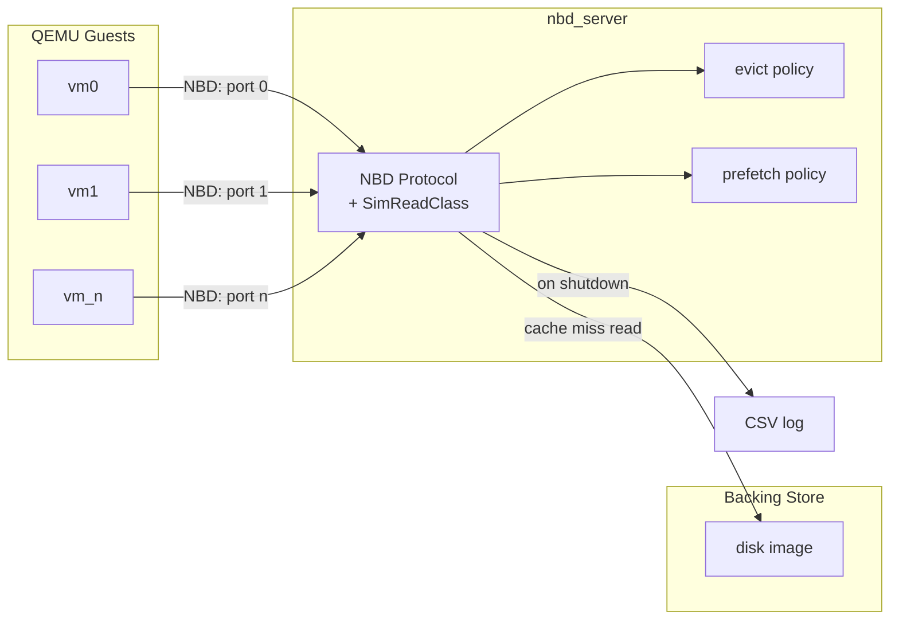

# newexp2: NBD-backed disk cache-policy simulator

This repo serves a backing file to real QEMU VMs over the NBD wire protocol,
running every read through a software-managed cache/policy simulator, so
that cache replacement and prefetch policies can be measured against actual
VM disk traffic rather than a synthetic workload generator.

The workflow is:

1. **Create disk** — provision a backing file (`make disk`).
2. **Spin up disk server** — `nbd_server` (`disk/nbd.cpp`) serves that file
   over NBD, one TCP port per client identity, running every read through
   `policy::Cache` and a configured evict/prefetch policy (`make nbd-run`).
3. **Spin up VMs** — QEMU guests attach the server's ports as ordinary
   virtio-blk disks (`make vms-up`, wraps `kvm/launch.py`).
4. **Test on VMs** — drive the guests directly (ssh/console); their disk
   I/O is transparently going through the simulator.
5. **Get measurements & log** — stop the server (Ctrl-C/SIGTERM); it
   appends one row of hit/miss/latency stats to a CSV log.



## Components

### disk/nbd.cpp (`nbd_server`)

Implements the NBD wire protocol (fixed newstyle handshake,
`NBD_OPT_EXPORT_NAME`, simple-reply transmission) so the in-kernel `nbd`
driver, `nbd-client`, or QEMU's `driver=nbd` block backend can attach to it
directly. Reads are served through `disk/sim.hpp`'s `SimReadClass`, so every
byte a guest reads is charged simulated hit/miss latency and run through
whatever evict/prefetch policy is configured — writes/trims/flushes are
accepted and discarded (nothing a guest writes is ever persisted).

The server listens on one TCP port per entry in a config file's `ports:`
list. **Each port is its own client identity**: a VM disk that dials a given
port is tracked separately from every other VM's disk for cache
virtual-time/prefetch purposes (`worker_id` in `SimReadClass`) — assign one
port per VM disk you want the simulator to treat as distinct. Note that all
ports on one `nbd_server` process still read from the *same* backing file;
if VMs need genuinely different disk contents, run separate `nbd_server`
processes (or configs) with different `file:` paths.

Takes a single argument: a config file path (a deliberately small YAML
subset — flat `key: value` lines, `#` comments, one inline list for
`ports:`). See [`disk/nbd.example.yaml`](disk/nbd.example.yaml) for the full
schema (backing file, ports, cache capacity, hit/miss latency, warmup,
evict/prefetch policy, log path).

### disk/sim.hpp (`SimReadClass`)

Drives `policy::Cache`/`policy::CachePolicy` from real NBD read requests
(offset/length in bytes, converted to `SECTOR_SIZE`-sized pages) instead of
a synthetic request generator. For each request it: checks cache presence
per page, runs the configured prefetch policy's `on_prefetch_request` (then
admits whatever it suggests), runs the evict policy's `on_access`, and
charges simulated latency accordingly — then serves the actual bytes via
`pread` on the backing file (thread-safe/offset-explicit, since the backing
`FILE*` is shared across every client thread).

### policies/

Evict policies (`evict_policy:` in the config): `none`, `fifo`, `lifo`,
`lru`.

Prefetch policies (`prefetch_policy:`): `none`, `readahead` (fetches the
next `MAX_PREFETCH_PAGES` pages), and three association-mining policies
sharing one engine ([`policies/assoc_miner.h`](policies/assoc_miner.h)) —
`cminer` (one shared association table across all clients), `quickmine`
(one table per client context, so unrelated clients' accesses don't pollute
each other's associations), and `mithril` (like `cminer`, but skips pages
that have already gone "hot," reserving mining budget for
sporadically-recurring pages).

`policy_lru_cxt_aware.cpp` is a context-aware LRU variant, partitioned by
client identity while keeping total cache capacity fixed.

### kvm/launch.py

Spins up/tears down one or more QEMU guests from a YAML config (see
[`kvm/vms.example.yaml`](kvm/vms.example.yaml)) — every disk a VM lists gets
its own `driver=nbd` QEMU block backend pointed at an `nbd_server`
host:port, so inside the guest each disk enumerates as a completely
ordinary local block device (`/dev/vda`, `/dev/vdb`, ...); the NBD
transport is invisible to it. Requires PyYAML and, wherever it actually
runs, `qemu-system-{arch}` with KVM available.

## Build and Run

Everything below is Linux-only (`disk/nbd.cpp` needs `<endian.h>`;
`kvm/launch.py` needs `qemu-system` and `/dev/kvm`) — run it on the Linux
host/VM that will actually host the disk server and the guests.

1. **Create the disk** — a sparse, zero-filled backing file, left alone
   after creation (delete it yourself to resize/reset; `dd` real content
   into it, or write files to it from inside a guest, once VMs can attach):

```bash
make disk DISK_SIZE=4G
```

2. **Build and start the disk server** — builds `nbd_server`, generates
   `disk/nbd.yaml` from the `NBD_*` variables, and runs in the foreground:

```bash
make nbd-run NBD_PORTS="10809 10810" NBD_EVICT_POLICY=lru NBD_PREFETCH_POLICY=cminer
```

3. **Spin up VMs** — copy `kvm/vms.example.yaml` to `kvm/vms.yaml` (or set
   `VMS_CONFIG`), point each disk's `nbd.host`/`nbd.port` at the machine and
   port(s) from step 2, then:

```bash
make vms-up
```

4. **Test on VMs** — ssh/console into a guest and drive it directly; its
   disk I/O is going through `nbd_server`'s cache simulation. `nbd_server`'s
   stderr logs a line per accepted connection, so that's the first signal a
   guest actually reached it.

5. **Stop and collect measurements** — Ctrl-C (or `SIGTERM`) the server from
   step 2; it appends one row to the CSV log (see below), then:

```bash
make vms-down
```

Remove build artifacts (binaries only — the disk image and logs are left
alone) with `make clean`; `make disk-clean` removes the disk image
specifically.

All `NBD_*`/`DISK_*`/`VMS_CONFIG` Makefile variables can be overridden at
invocation; see the Makefile for the full list and their defaults.

## Logging Schema

On a clean shutdown (`SIGINT`/`SIGTERM`), `nbd_server` prints one
`STATS key=value ...` summary line to stdout and appends one CSV row to the
config's `log:` path (default `./logs/nbd_results.csv`), writing a header
first if the file is new or empty. Columns:

- `timestamp`, `machine`, `commit_hash` — when/where/which commit ran
- `file`, `ports`, `capacity`, `hit_latency_ns`, `miss_latency_ns`,
  `warmup`, `evict_policy`, `prefetch_policy` — the run's config
- `request_count`, `hits`, `misses`, `hit_ratio`, `evictions`, `bytes_read`,
  `bytes_written` — cache outcomes
- `avg_latency_ns`, `worker_latency_ns`, `policy_latency_ns` — timing
  breakdown (total simulated latency charged per request; time attributed
  to client think-time vs. evict/prefetch policy hook compute, respectively)
- `runtime_seconds` — wall-clock time the server was up

## Commenting and Code Style Guidance

To keep implementation readable while performance-tuning:

- Comment synchronization decisions (lock ordering, atomic ownership, wait conditions).
- Comment policy edge cases (eviction tie-breaks, per-context partition behavior).
- Comment wire format assumptions for request/response messages (NBD protocol, config parsing).
- Avoid redundant comments for obvious operations.

Example style:

```cpp
// Preserve a total order on locks to avoid inversion between request and eviction paths.
std::scoped_lock lk(global_mu, shard_mu);

// Treat warmup requests as non-observable for user-facing latency metrics.
if (request_index < warmup_period) {
	return;
}
```
