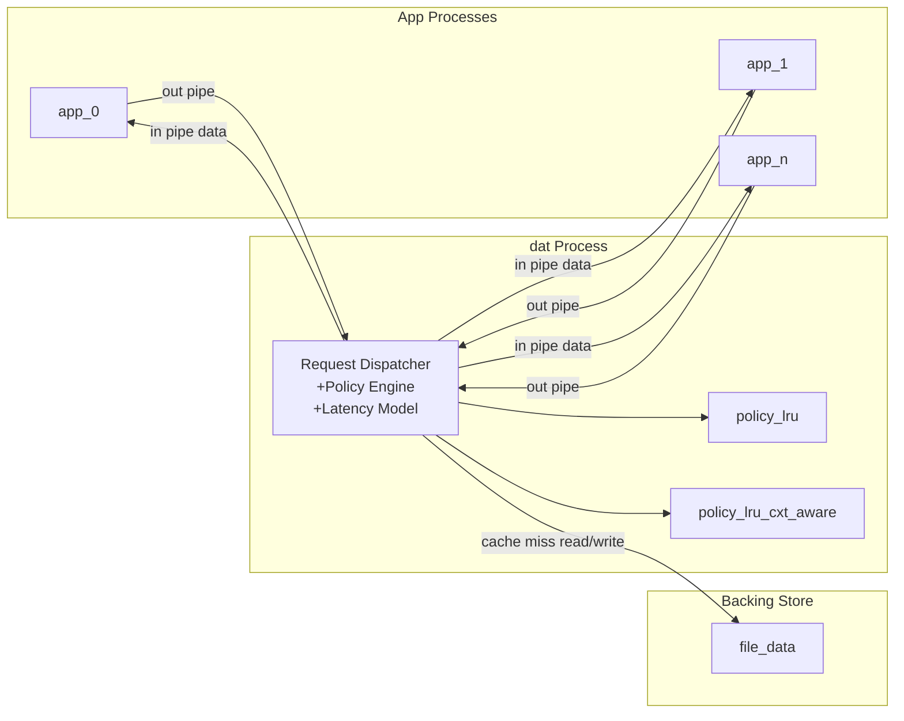

# newexp2 Cache Policy Experiment

This experiment compares software-managed cache replacement policies for N server apps that access a shared remote volume.

The runtime model is:

1. `runner` creates 2*N pipes and starts one `dat` process.
2. `runner` starts N app processes, each with a configured behavior (`scan`, `random-read`, `zipfian`, `latest`, or `trace`).
3. Each app sends requests to `dat` over an outbound pipe and receives data over an inbound pipe.
4. `dat` serves each request from cache (hit) or backing store (miss), optionally adding configured latency.
5. `runner` aggregates metrics and appends a log row.

## Architectural Design



## Components

### app.cpp

Represents one server workload process.

- `--behavior`: `scan`, `random-read`, `zipfian`, `latest`, `trace`, or `markov`
- `--seed`: per-process deterministic seed
- `--in-pipe`: read data replies from `dat`
- `--out-pipe`: send IO requests to `dat`
- `--requests`: number of ops this app issues (default `20000`)
- `--page-span`: size of the address space apps draw pages from (default `65536`)
- `--zipfian-alpha`: Zipfian skew constant, used by `--behavior zipfian` and `--behavior latest` (default `0.99`)
- `--read-ratio`: fraction of ops that are reads (vs. inserts of new "latest" keys), used only by `--behavior latest` (default `0.5`)
- `--scan-length`: pages walked per scan op, used by `--behavior zipfian`/`random-read` when `--scan-ratio > 0` (default `100`, matching YCSB's default `maxscanlength`)
- `--scan-ratio`: fraction of ops that are scans (vs. single-page reads), used by `--behavior zipfian`/`random-read` (default `0`)
- `--trace-file`: path to a trace, used only when `--behavior trace`; a newline-separated list of `uint64` page numbers replayed in order
- `--markov-base`: the behavior to sample training data from, used only when `--behavior markov` (any other behavior name)
- `--markov-samples`: number of pages sampled from `--markov-base` to fit the model, used only when `--behavior markov` (must be `>= 3`)
- `--markov-relative-weight`: see "Markov workload" below, used only when `--behavior markov` (default `0.5`)

Each app runs independently in parallel, and multiple app instances can run on the same machine.

#### Markov workload

`--behavior markov` exists because Zipfian/Latest draw each page i.i.d. from a
distribution — there's no real "page X is followed by page Y" structure, so
prefetchers that mine page-follows-page associations (`cminer`/`quickmine`/`mithril`,
see [`policies/assoc_miner.h`](policies/assoc_miner.h)) have nothing genuine to learn
from them. `markov` fits a model from the first `--markov-samples` pages of another
workload's own output (`--markov-base`), then generates its actual request stream via
a Metropolis-Hastings (MH) random walk over that fit, instead of replaying the source.

MH matters here, not just a stylistic choice: an earlier version generated pages by
composing observed jumps directly (`next = current_page + jump`), with no guarantee
about where that composition ends up. Empirically it didn't stay anywhere near the
source's own popularity concentration — 20k generated pages from a `Zipfian(0.99)`
source visited 99.45% distinct pages spanning the *entire* page span, vs. 58% distinct
for the source itself. Since a source's popularity concentration (e.g. Zipfian's hot
set) is exactly what drives cache hit ratio, that made `markov` a much harder,
unrealistic workload rather than a like-for-like comparison. MH fixes this: it's an
accept/reject scheme with a mathematical guarantee that the walk's long-run page-visit
frequency converges to a specified target distribution — here, the source's own
empirical histogram — no matter what "local" proposal moves drive it.

The model fits two tables from consecutive training pages `page[i-1] -> page[i]`,
plus the marginal visit count per page (the MH target distribution):

- `direct[P] -> {Q: count}` — how often `Q` was adjacent to `P` in training.
  Built as a **symmetric** table (`direct[P][Q] == direct[Q][P]`, both directions
  incremented for every observed pair) so that every proposed edge has a
  well-defined, always-computable reverse probability. An earlier, directed-only
  version relied on the reverse pair also having been independently observed in
  training, which at realistic sample sizes it almost never was — most edges are
  singleton observations — collapsing MH's acceptance rate to ~0 and leaving the
  walk stuck self-looping on its seed page.
- `delta_freq[D] -> count` — how often a (signed) jump of size `D` was observed
  between consecutive training pages, **symmetrized** (`delta_freq[D] ==
  delta_freq[-D]` by construction: every observed `d` adds a count to `-d` too).

Each generation step draws `Bernoulli(--markov-relative-weight)` to pick a proposal
kernel — "relative" (propose `current_page + D` via `delta_freq`) or "direct"
(propose `Q` via `direct[current_page]`) — then accepts with the standard MH ratio,
using each table's symmetry to make the reverse probability always computable
instead of a lookup that's usually missing. Rejected proposals self-loop (repeat the
current page) — a normal MH outcome, not an error.

In practice `direct` reproduces the source's popularity profile almost exactly
(measured: 99% of a Zipfian source's distinct pages recovered, hot-page share within
~0.2pp of the source); `relative` mixes much more poorly here, because a jump size
pooled from a hash-scrambled key space (e.g. Zipfian's own key hashing) spans nearly
the whole page range, so `current_page + D` rarely lands back on one of the source's
actually-popular pages at all. Keep `--markov-relative-weight` low (the default `0.5`
already leans this way; go lower, e.g. `0.1`, for closer fidelity to the source's own
hit-rate profile) — `relative` still contributes some jump-based structure, but
shouldn't dominate. If neither kernel has an entry for the current state (e.g. right
after seeding), the step falls back to proposing directly from the target
distribution, which is always accepted. The `--markov-samples` pages used for
training are never themselves emitted as requests — `--requests` counts only the
generated stream.

#### Op-type modeling and scan semantics

`dat` has no op-type-aware backend: every request is just "fetch this page," so there
is nothing for a UPDATE/INSERT/READ_MODIFY_WRITE op to do differently from a READ. The
only op type that changes wire behavior is SCAN, which walks `scan_length` consecutive
pages (wrapping modulo `--page-span`) from a single chosen start key, mirroring how
My-YCSB's backend clients implement `do_scan()` (see [`workloads/workload.h`](workloads/workload.h),
ported from [My-YCSB](https://github.com/xrp-project/My-YCSB)). So reproducing a target
YCSB op mix here only requires a read/scan split via `--scan-ratio`; a workload's
update/insert/read-modify-write proportion is represented as reads. This is not just a
simplification — for the workloads this repo runs (A/B/C/F: no scans), it produces
the *exact* page-access sequence real YCSB would, because My-YCSB's own key generation
is identical across UPDATE/INSERT/READ/READ_MODIFY_WRITE (only SCAN differs). See
[`tools/verify_against_myycsb/`](tools/verify_against_myycsb/) for a reproducible check
of this against the actual upstream source.

One consequence: since A, B, C, and F all reduce to a pure `Zipfian(0.99)` read stream
here, they will produce identical hit ratios in this simulator — that's expected, not a
bug. Only D (latest distribution) and E (scan-length) touch pages differently.

### dat.cpp

Represents the software-managed cache process.

- `--evict-policy`: `lru` or `lru-cxt-aware`
- `--capacity`: cache size in pages
- `--in-pipes`: list of app inbound pipes (`dat` writes responses)
- `--out-pipes`: list of app outbound pipes (`dat` reads requests)
- `--miss-delay`: minimum miss latency in ns
- `--hit-delay`: minimum hit latency in ns
- `--file-data`: path to file-backed remote store

The `dat` process is expected to have one blocked worker per outbound pipe so request handling can overlap across apps.

### policies/policy_lru.cpp

Global LRU replacement policy.

### policies/policy_lru_cxt_aware.cpp

Context-aware LRU replacement policy, partitioned by process identity while keeping total cache capacity fixed.

### runner.cpp

Experiment orchestrator.

- `--seed`: base seed (`seed + i` for app `i`)
- `--evict-policy`: `lru`, `lifo`, `fifo`, or `none`
- `--prefetch-policy`: `readahead` or `none`
- `--capacity`: cache size in pages
- `--miss-delay`: miss latency floor in ns
- `--hit-delay`: hit latency floor in ns
- `--file-data`: backing file path for `dat`
- `--requests`: ops per app, applied uniformly to every app (default `20000`)
- `--page-span`: shared address space size, applied uniformly to every app (default `65536`)
- `--warmup-period`: requests to exclude from reporting
- `--log`: output log path (append mode)
- `--config`: path to a config file; one app per line (see below)

The number of app processes (`-n` in older versions of this tool) is implicit: it's
the number of lines in `--config`.

The config file has one line per app process: `<behavior> [key=value ...]`. Keys are
behavior-specific and match the `app.cpp` flags above minus the `--` prefix; unset
keys fall back to `app.cpp`'s defaults, unless noted:

```
scan
random-read
random-read scan-ratio=0.3 scan-length=20
zipfian
zipfian alpha=1.2                          # Zipfian skew (default 0.99)
zipfian alpha=0.99 scan-ratio=0.95 scan-length=100
latest read-ratio=0.95                     # fraction reads vs. inserts (default 0.5)
trace file=traces/db_trace.txt             # replays the given trace file (see app.cpp above)
markov base=zipfian samples=5000 alpha=0.99 relative-weight=0.99  # see "Markov workload" above
```

Supported keys per behavior: `trace` requires `file=`; `zipfian` and `random-read`
accept `scan-ratio=` and `scan-length=` (`zipfian` also accepts `alpha=`); `latest`
accepts `read-ratio=`; `scan` and `random-read` (beyond the scan keys) accept none;
`markov` requires `base=` (any other behavior name) and `samples=` (`>= 3`), accepts
`relative-weight=` (default `0.99`), and otherwise accepts whatever keys its `base=`
behavior would (e.g. `base=zipfian` also accepts `alpha=`, `scan-ratio=`, etc.).
Using a key with the wrong behavior, or omitting a required one, is a config error.

Blank lines and lines starting with `#` are ignored.

## YCSB Workloads

[`configs/ycsb_a.txt`](configs/ycsb_a.txt) through [`configs/ycsb_f.txt`](configs/ycsb_f.txt)
reproduce the six standard YCSB core workloads' *page-access patterns*, sourced from
[My-YCSB](https://github.com/xrp-project/My-YCSB)'s own `rocksdb/config/ycsb_*.yaml`
reference configs:

| Workload | Mix (YCSB)                  | Distribution | Notes |
|----------|------------------------------|--------------|-------|
| A        | 50% read / 50% update        | zipfian(0.99)| update collapses to read here |
| B        | 95% read / 5% update         | zipfian(0.99)| update collapses to read here |
| C        | 100% read                    | zipfian(0.99)| |
| D        | 95% read / 5% insert         | latest       | only workload besides E with a distinct access pattern |
| E        | 95% scan / 5% insert         | zipfian(0.99)| scan-length=100; insert collapses to read |
| F        | 50% read / 50% read-modify-write | zipfian(0.99) | read-modify-write collapses to read here |

See "Op-type modeling and scan semantics" above for why update/insert/read-modify-write
collapse to reads without changing the resulting page-access sequence. Run one with, e.g.:

```bash
make run CONFIG=configs/ycsb_e.txt PAGE_SPAN=10485760 REQUESTS=200000
```

### Verifying against real YCSB

[`tools/verify_against_myycsb/run.sh`](tools/verify_against_myycsb/) is a concrete,
reproducible check of `workloads/workload.cpp` against the exact upstream source it
was ported from (My-YCSB, pinned to a specific commit). It builds two tiny harnesses —
one linked against our `workloads/workload.cpp`, one linked against the untouched
upstream `core/workload.cpp` — runs both with identical seeds and parameters for each
YCSB-relevant workload shape (zipfian read, zipfian scan, latest, uniform), and diffs
the resulting key/scan-length sequences. Because both sides use the same `rand_r()`
seed and the same zipfian/latest formulas, a faithful port should produce byte-for-byte
identical output, not just a statistical match — this is exactly what the script checks:

```bash
tools/verify_against_myycsb/run.sh
```

It clones My-YCSB into `build/vendor/my-ycsb` on first run (network required) and
reuses it afterward. The only patch applied to the upstream file is stripping two
`#include <bpf/...>` lines that are unreachable dead code in the pinned commit (the
BPF calls they support are already commented out) and exist only to support Linux;
no logic is modified.

Notes:

- Although component behavior is listed as command-line arguments, normal usage should be via `runner`-managed process startup.
- Hit and miss delays are awaited concurrently per request path and model local-vs-remote latency differences.

## Build and Run

1. Build all binaries:

```bash
make
```

2. Run a sample experiment:

```bash
make run \
  SEED=7 \
  EVICT_POLICY=lru \
  PREFETCH_POLICY=readahead \
  CAPACITY=8192 \
  MISS_DELAY_NS=500000 \
  HIT_DELAY_NS=30000 \
  WARMUP=10000 \
  FILE_DATA=./data.bin \
  LOG=./logs/results.csv \
  CONFIG=configs/ycsb_c.txt
```

The number of app processes comes from the number of lines in `CONFIG`, not a
separate `N` variable.

3. Remove build artifacts:

```bash
make clean
```

## Logging Schema

Each run appends a row that includes:

- input configuration
- machine identifier
- commit-hash
- hits
- misses
- hit ratio
- evictions
- bytes read
- bytes written
- average latency

## Commenting and Code Style Guidance

To keep implementation readable while performance-tuning:

- Comment synchronization decisions (lock ordering, atomic ownership, wait conditions).
- Comment policy edge cases (eviction tie-breaks, per-context partition behavior).
- Comment wire format assumptions for request/response messages over pipes.
- Avoid redundant comments for obvious operations.

Example style:

```cpp
// Preserve a total order on locks to avoid inversion between request and eviction paths.
std::scoped_lock lk(global_mu, shard_mu);

// Treat warmup requests as non-observable for user-facing latency metrics.
if (request_index < warmup_period) {
	return;
}
```

